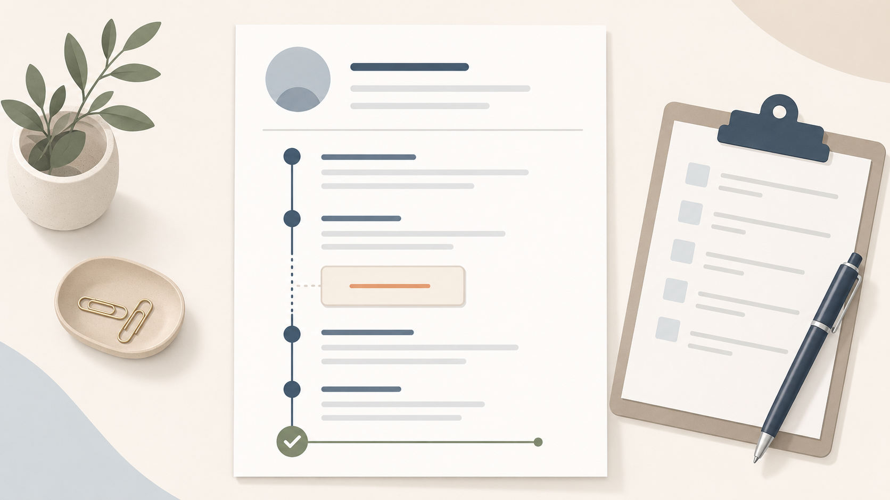

Пробел в стаже больше полугода не отпугивает HR сам по себе — отпугивает тишина вокруг него. Работодатель додумывает за вас, и додумывает обычно хуже, чем есть на самом деле.

Не оставляй дыру пустой: коротко, в одну строку, объясни причину прямо в резюме или сопроводительном — HR сам додумает худшее (уволили, проблемы с дисциплиной), если ты промолчишь. Покажи, что за это время ты не деградировал — учился, фрилансил, восстанавливался, — и переходи дальше, не оправдываясь на полстраницы.

## Почему рекрутер настораживается, увидев дыру в стаже

Соискатели часто гадают, почему не берут на работу после перерыва, и винят в этом сам пробел в трудовом стаже — или, как его называют на английский манер, gap в резюме. Дело не в паузе как таковой: по данным hh.ru (исследование среди 159 российских компаний, сентябрь 2025 года), 98% работодателей относятся к перерывам с пониманием, и только 2% настроены негативно. Половина опрошенных (52%) оценивает причину индивидуально, а 46% прямо говорят: важнее актуальные навыки и мотивация, а не факт паузы. Кандидата с перерывом больше полугода регулярно встречает половина рекрутеров, ещё 47% — время от времени. Похожие цифры перепечатывают и другие издания — например, Forbes Life и CNews, ссылаясь на то же исследование hh.ru.

Пугает рекрутера не перерыв, а неизвестность внутри него. Когда причина не названа, вступает воображение: 28% работодателей, столкнувшись с необъяснённой паузой от года и дольше, опасаются, что кандидат растерял навыки, 20% — что упала мотивация, 6% сразу думают о безответственности. При этом сама пауза давно не приговор: 47% рекрутеров считают её профилактикой выгорания, 25% — шагом к более осознанной карьере, 19% — фактором, который повышает продуктивность после отдыха.

Раньше было строже: по некоторым пересказам данных SuperJob, ещё в 2010 году лояльно к перерывам относилась примерно четверть рекрутеров — хотя эта цифра дошла до нас как вторичный пересказ, и к ней стоит относиться как к иллюстрации, а не как к точному факту. Вывод за 15 лет один: рынок труда привык к паузам. Не привык он только к молчанию о них — а молчание почти всегда читается как «есть что скрывать».

## Где именно писать объяснение: резюме или сопроводительное

Кажется логичным спрятать паузу — вдруг не заметят. Заметят: дата окончания одного места и начала другого видна с первого взгляда на блок опыта.

Разбираясь, как объяснить перерыв в работе, начните с выбора места: правильное место зависит от длины объяснения. Если причина укладывается в одну строку — пишите её прямо в резюме, отдельным пунктом опыта или короткой ремаркой рядом с датами: «2023–2024 — перерыв, уход за ребёнком». Резюме сканируют за секунды, и такая строка снимает вопрос ещё до того, как он возник.

Если причина требует пары предложений контекста — например, вы меняли сферу или совмещали паузу с проектом — переносите объяснение в сопроводительное письмо. Там есть место сказать чуть больше, не перегружая резюме текстом не по формату. Правило простое: резюме — для факта, сопроводительное — для контекста. Смешивать не нужно: абзац объяснений в резюме выглядит как оправдание, а не как факт биографии.

## Готовые формулировки под конкретные причины

Ниже — примеры того, как долгий перерыв в работе выглядит в резюме, если объяснить его коротко и честно: для каждой причины не нужно придумывать что-то уникальное, хватает одной прямой фразы — конкретика работает лучше извинений. Вот как объяснить декрет в резюме и другие частые причины паузы одной точной строкой:

**Декрет:**
«С 2016 по 2018 год находилась в отпуске по уходу за ребёнком. Ребёнок ходит в сад, адаптационный период прошёл успешно, на подхвате — две бабушки и няня. Соскучилась по работе.»

**Здоровье:**
«С июля 2017 по март 2018 года — восстановление после перелома ноги. Сейчас полностью здоров, ищу работу в офисе на полный день.»

**Уход за близким:**
«Последние полгода — уход за тяжелобольным родственником. В настоящий момент такой необходимости уже нет, приоритет — работа.»

**Учёба:**
«Проходил обучение в [учебное заведение], специальность — [область]. Хочу применить предыдущий опыт и полученные знания.»

**Поиск работы или фриланс:**
вместо жалобы на затянувшиеся поиски — перечислите конкретные проекты, которые реализовали за этот период, с результатами. Факты убеждают лучше, чем оправдания.

Общий принцип виден во всех примерах: дата, причина, текущее состояние, готовность работать. Ни одного лишнего слова.

## Ошибки, которые проваливают объяснение

Вы уже написали причину — казалось бы, дело сделано. Но формулировка может испортить впечатление сильнее, чем сама пауза.

Первая ошибка — агрессивный или защитный тон. Строка вроде «Представителям кадровых агентств не беспокоить!!!» с тремя восклицательными знаками говорит рекрутеру не о паузе, а о вашей раздражительности прямо сейчас.

Вторая — жалоба вместо объяснения. «Устала объяснять, почему была в декрете» — это не информация, а эмоция, и на месте рекрутера её читать неприятно.

Третья — односложные ответы, которые не раскрывают тему ни в резюме, ни на собеседовании. Такое молчание рождает те же домыслы, что и полное отсутствие объяснения.

Четвёртая — объяснение без подтверждения компетентности. Сказать «была в паузе» недостаточно, если следом не показать, что вы всё ещё в форме профессионально.

Есть и обратная крайность — объяснение на абзац с датами, диагнозами и подробностями личной жизни. Никто не просит отчёт. Одна строка факта работает лучше, чем три абзаца оправданий.

## Как показать, что пауза была не пустой

Соблазн — впихнуть в резюме все курсы и подработки за время паузы, лишь бы доказать, что не бездельничали. Это не обязательно.

Часть рекрутеров вообще не считает, что паузу нужно было чем-то заполнять: 47% работодателей воспринимают её как профилактику выгорания, а 19% — как фактор, который повышает продуктивность после возвращения. То есть отдых сам по себе — не проблема, которую нужно оправдывать активностью.

И всё же показать полезную активность стоит — это снимает даже те немногие сомнения, которые остаются. Вынесите её отдельным пунктом, не смешивая с основным опытом: курсы и сертификаты — отдельной строкой с датой прохождения, фриланс-проекты — с конкретным результатом, волонтёрство — коротко, но по делу. Не нужно оправдываться, что вы «не просто отдыхали» — достаточно факта, что вы развивались.

## Если спросят устно на собеседовании

Кажется, что устный вопрос требует более развёрнутого ответа, чем строка в резюме. Не требует.

Используйте ту же формулировку, что уже написали в резюме или сопроводительном — не придумывайте на ходу новую версию, это выглядит непоследовательно. Отвечайте коротко и не углубляйтесь в детали, которых не спрашивали. Дальше сразу переводите фокус на то, что важно сейчас: вы готовы работать, ваши навыки актуальны, вы пришли обсуждать будущее, а не оправдываться за прошлое.
