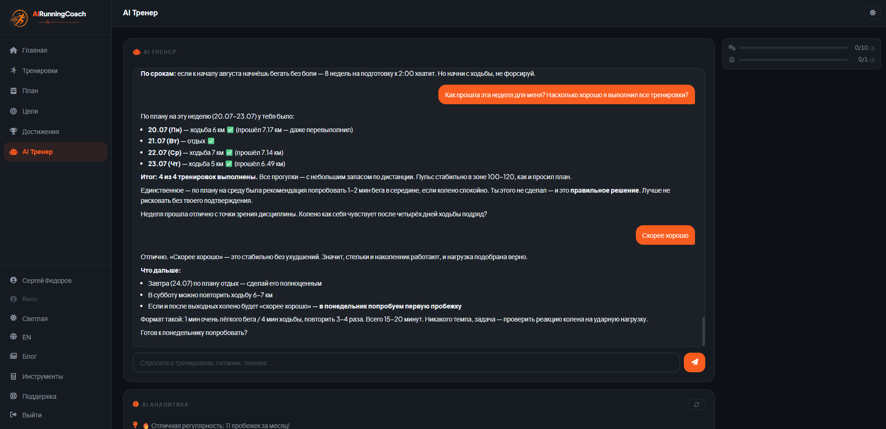
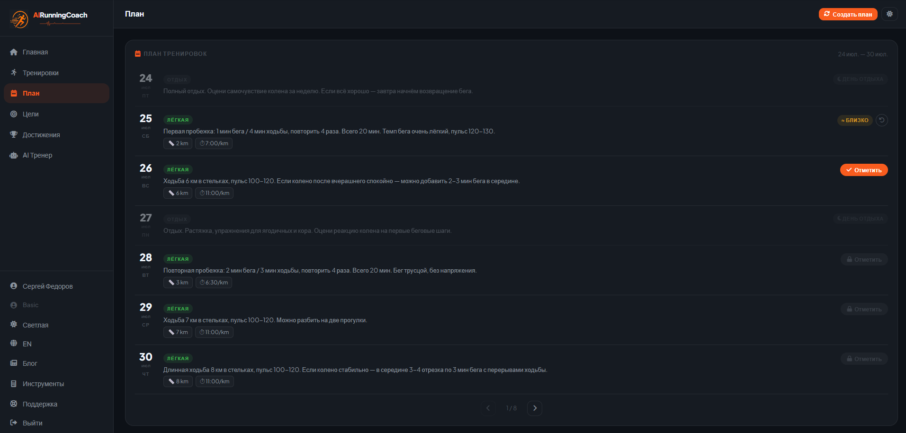
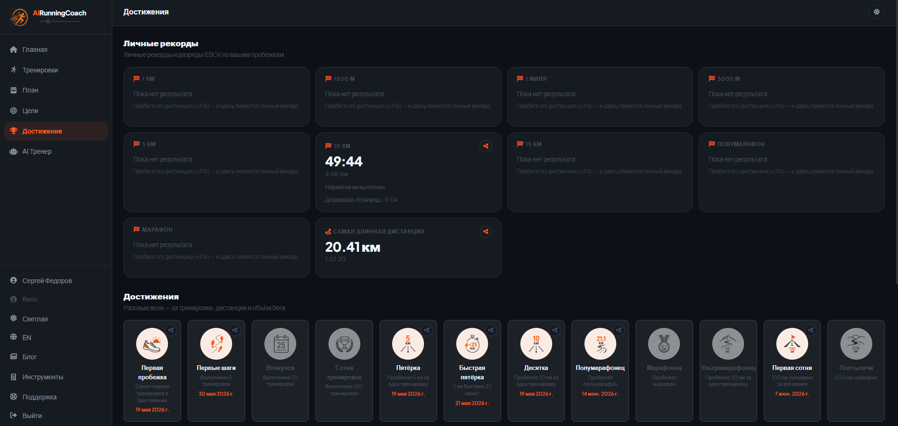
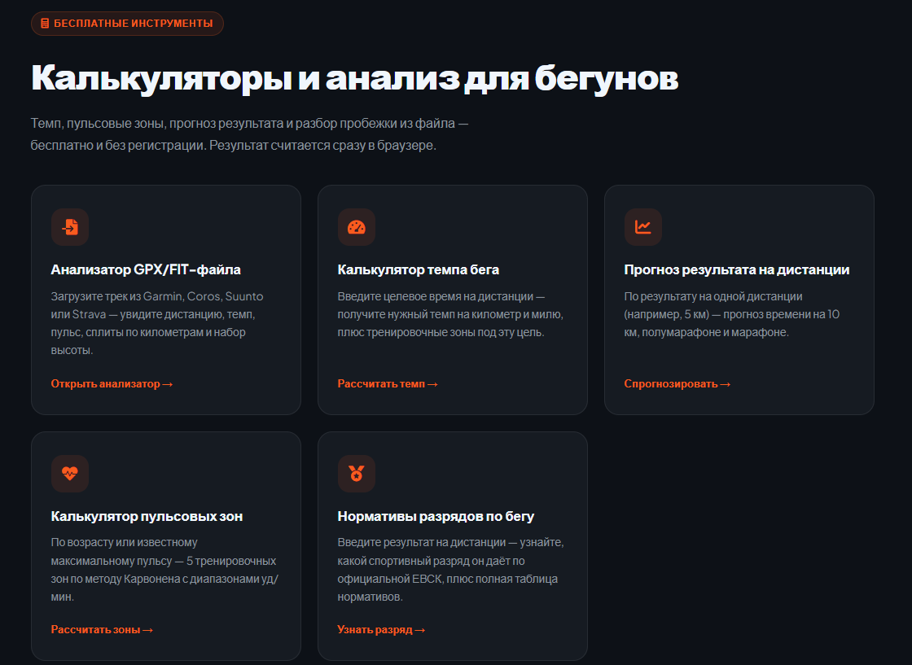
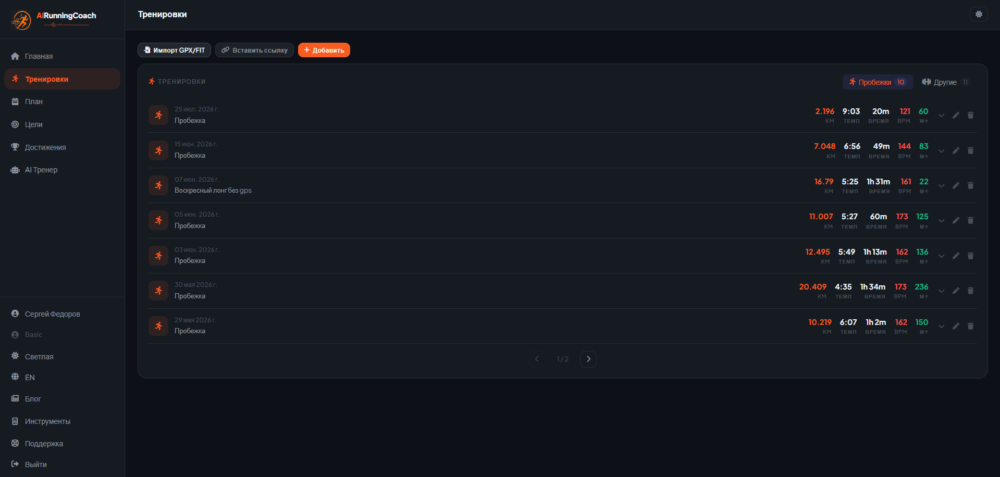
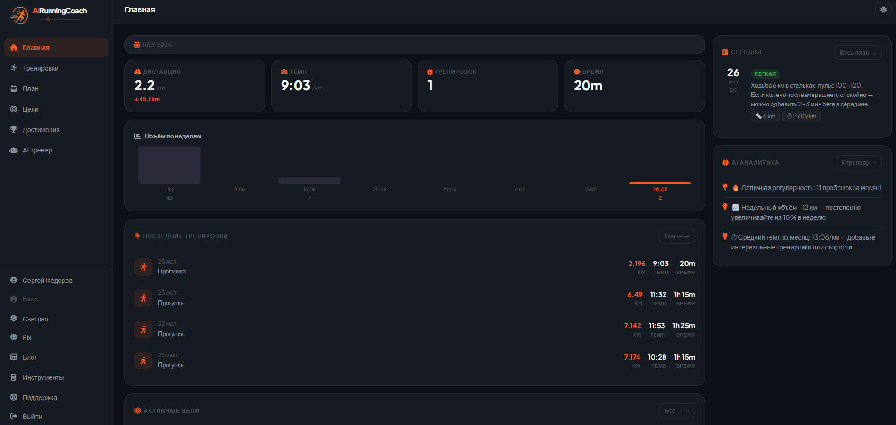

## После проваленного собеседования: почему пет-проект, а не ещё одно резюме

Собеседование я тогда завалил. Не буду врать, что отнёсся к этому спокойно, любой отказ немного выбивает из колеи. Вместо того чтобы продолжать долбить hh и рассылать резюме дальше, я сел за код (хотя и отклики совсем на 0 тоже не ставил). Как раз незадолго до этого перешёл на Claude Code, и первое, что придумал сделать - не тестовое задание и не учебный туториал, а настоящее приложение.

Почему не ещё одно резюме? Потому что резюме и так у меня было, а вот пробел в опыте - нет. И заполнить его текстом про "ищу работу и развиваюсь" как-то не хотелось. Я решил, что лучше потратить это время на что-то, что реально можно будет показать. Не эксперт по карьерным стратегиям, но логика простая: пока ты ищешь работу, время всё равно идёт, и вопрос только в том, чем ты его заполнишь =)

## Пет-проект, который решает вашу собственную проблему, убедительнее абстрактного

Идея пришла не из головы, а из личной боли. Я бегаю с 2023 года, старался делать это постоянно. А в этом году что-то сломалось: начал часто болеть, и этой зимой бег пришлось совсем забросить. Весной попробовал вернуться, даже получалось какое-то время, но без плана регулярность быстро разваливалась. Болезни всё ещё мешали, график скакал туда-сюда, и я понял, что мне очень не хватает взгляда со стороны на мои тренировки.

Логичным решением был бы тренер. Но платить 2000 рублей или больше каждый месяц за план тренировок, когда у меня есть навыки программирования и опыт работы с нейросетями, показалось странным. Зачем платить за то, что можно попробовать сделать самому? Так родилась идея объединить бег и код в один SaaS-проект.

Тут, мне кажется, и есть главное отличие пет-проекта "для портфолио" от пет-проекта, который реально доводишь до конца. Когда ты сам - целевая аудитория, ты не выдумываешь фичи, а решаешь конкретную проблему конкретного человека, то есть себя. Мне не нужно было гадать, что важно бегуну, я сам бегун, у меня непостоянный график и разбитые зимой планы.

## Что внутри AIRunningCoach: ИИ-тренер, импорт тренировок, игровая часть

Так появился AIRunningCoach - беговой ИИ-тренер. Вместо готового шаблонного плана на 12 недель вперёд, который надо просто выполнять, он строит план под конкретного человека и разбирает каждую пробежку отдельно. Делаю его один: бэкенд, фронтенд, AI-часть, деплой - всё сам.

Ядро сервиса - AI-тренер, с которым можно переписываться примерно как с человеком. Он видит всю историю тренировок пользователя и разбирает каждую новую пробежку: где темп поехал не туда, стоит ли наращивать объём, не пора ли отдохнуть. План тоже строит сам - по возрасту, весу, росту и цели - а дальше подстраивает его под то, как тренировки реально проходят, а не держит жёсткий шаблон несмотря ни на что.

Тренировки загружаются из GPX и FIT файлов с Garmin, Coros, Suunto. Недавно добавил ещё импорт по прямой ссылке на экспорт с часов - оказалось, не все модели дают файл для скачивания, некоторые просто отдают ссылку, и раньше приходилось сначала качать файл руками, а потом заново грузить его на сайт. Мелочь, а раздражала меня самого каждый раз.

Есть и игровая часть: личные рекорды на дистанциях от километра до марафона, бейджи за объём, серии тренировок без пропусков, набор высоты. Отдельно считается спортивный разряд по официальной таблице ЕВСК, если результат подходит под норматив - что приятно, за один финишированный марафон, даже не самый быстрый, уже присваивается третий разряд.

Для тех, кто не хочет регистрироваться, оставил бесплатные калькуляторы: разбор GPX/FIT-файла, расчёт темпа, прогноз результата на дистанции по одному забегу, пульсовые зоны, разряды.

## Стек, который реально видно в резюме: Vue 3, FastAPI, Postgres, DeepSeek API

Отдельно хочу сказать про технологии, потому что именно это в итоге и попало в резюме. Фронтенд на Vue 3, бэкенд на FastAPI, база на Postgres, всё упаковано в докер-контейнеры и крутится на собственном VPS с nginx. За AI-часть отвечает DeepSeek. Сервис двуязычный, есть русская и английская версии.

Ничего сверхъестественного тут нет, но это живой, актуальный стек, а не набор технологий из учебника трёхлетней давности. Когда на собеседовании спрашивают "с чем вы работали", гораздо приятнее отвечать не "проходил курс", а "вот, делал на этом продакшен-сервис, вот ссылка, можете сами потыкать".

## Довести до продакшена - это не только код: самозанятость, ЮKassa, документы

Вот тут началась часть, которую я как программист совсем не планировал, но которая, кажется, дала мне не меньше, чем сам код. Я самозанятый, оплата идёт через ЮKassa, чек на каждый платёж формируется автоматически через приложение "Мой налог" - и это не опция, а обязательное требование, чек нужно пробивать не позднее дня получения денег, иначе штраф 20% от суммы, а при повторном нарушении в течение полугода - все 100%. Так что тут расслабляться нельзя.

Я не бухгалтер и не юрист, поэтому разбираться в налоговом режиме пришлось с нуля: какой лимит дохода у самозанятых (сейчас это 2,4 млн рублей в год), как правильно подключить приём платежей, какие документы обязательны для сайта, который берёт деньги с людей - политика конфиденциальности, условия использования. Оказалось, что это отдельная, довольно объёмная работа, никак не связанная с кодом напрямую, но без неё проект просто нельзя было бы легально запустить.

Именно этот кусок, мне кажется, и отличает "поделку на github, которую никто не видел" от настоящего продакшен-проекта. Написать код - это половина дела. Довести его до состояния, где реальный человек может реально заплатить и получить чек, это совсем другой уровень ответственности =)

## Как указать пет-проект в резюме, чтобы закрыть разрыв и не соврать

Тут я не эксперт по подбору персонала, поэтому опираюсь на то, что советуют карьерные консультанты, а мнения там, честно говоря, расходятся в деталях. Но в одном все сходятся: период в резюме лучше не оставлять пустым и не размывать невнятными формулировками вроде "занимался частной практикой" - это выглядит подозрительно, и рекрутеры такое подмечают. Последнее место работы вообще проверяют внимательнее всего, и если что-то приукрасить, это довольно быстро всплывает на созвоне или техническом собеседовании.

Я решил не маскировать этот период под штатную должность, а написать честно: что-то вроде "Самозанятый разработчик" или "Основатель AIRunningCoach" в качестве последнего места. Это правда, и это не стыдно. Указал те технологии, которые начал реально применять за это время, а не те, что были в резюме "для галочки" ещё с прошлой работы.

Есть и другой подход - вообще не расписывать перерыв подробно, а просто подготовить честное объяснение на словах, если спросят. Оба варианта имеют право на жизнь, тут я бы советовал смотреть по себе: если про проект приятно рассказывать и есть что показать, писать его прямо в резюме, наверное, выигрышнее.

## Что это дало в итоге и как решить, нужен ли вам такой проект

Если подытожить, пет-проект в моём случае не сработал как красивая строчка в портфолио. Он сработал как способ не терять время между собеседованиями и честно закрыть разрыв в резюме, вместо того чтобы делать вид, будто его нет. Плюс дал актуальный стек, который приятно обсуждать, а не отмалчиваться.

Но если бы я делал только код без доведения до продакшена, ценность, кажется, была бы намного меньше. Незавершённые проекты не особо впечатляют, а вот доведённый до конца, работающий, документированный проект - это уже весомый аргумент на собеседовании, даже без коммерческого опыта за плечами. Платежи, документы, самозанятость - это как раз то, что показывает не только "умею писать код", но и "умею доводить дело до конца и брать на себя ответственность", а это работодателю обычно важнее любой строчки про фреймворки.

Так что если вы сейчас думаете, стоит ли делать такой проект после отказа - я бы спросил себя не "выглядит ли это солидно", а "решает ли это мою собственную проблему". Если да, дальше уже проще: код рано или поздно напишется, а мотивация не иссякнет, потому что вы делаете это в первую очередь для себя, а не для чужого HR. А у вас был свой пет-проект, который вырос из личной боли, а не из желания что-то добавить в резюме?

По традиции, всем дочитавшим - лёгких пробежек и планов, которые реально получается выполнять. Как-то так. 😌
