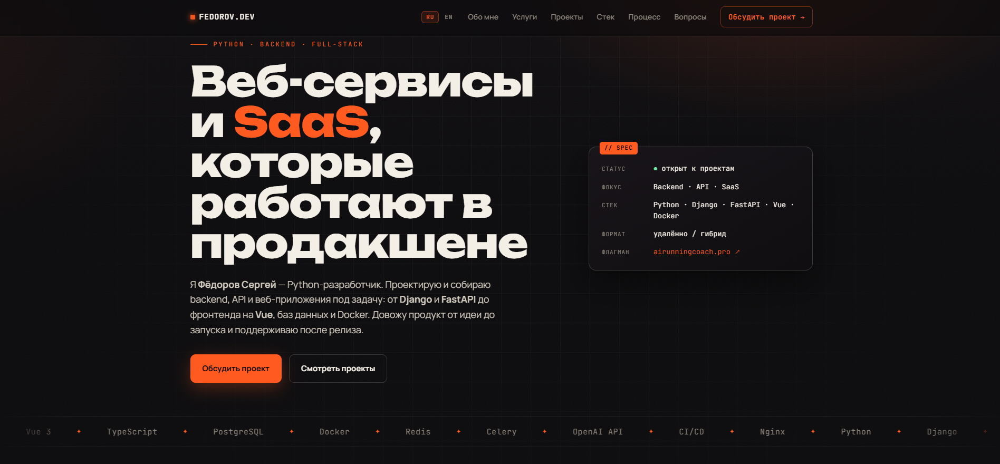
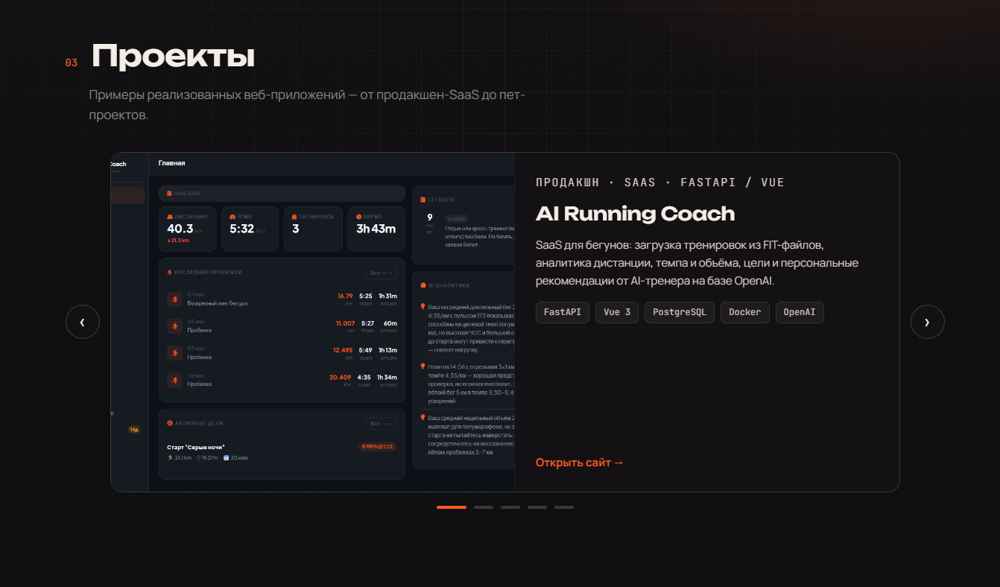

2 месяца назад у меня не было нормального публичного места, куда можно отправить заказчика или рекрутера. GitHub есть, но это не то - там код, а не история про меня. Решил сесть и сделать сайт. Как именно - я уже подробно расписывал в прошлой статье про GitHub Pages, тут повторяться не буду, коротко: первую версию собрал в Cursor, просто чтобы посмотреть, как сам инструмент работает. Спустя 2-3 недели уже нормально доработал в новом для себя инструменте - Claude Code.

И вот прошло два месяца активного поиска работы. Пора честно посмотреть, что портфолио реально дало, а что нет =)

## Что в портфолио сейчас

Сайт живёт на fedorov-dev.ru, и концепция там всё та же - одна страница, ничего лишнего. Без React, без сборщиков, чистые HTML, CSS и немного JavaScript. Хотел, чтобы грузилось мгновенно и не требовало поддержки. Пока держится =)

Внутри семь блоков. Коротко о себе и стеке (Python, Django, FastAPI, Vue, PostgreSQL, Docker). Список услуг - что конкретно я делаю. Карусель проектов, где флагман - airunningcoach.pro, SaaS для бегунов с AI-тренером на базе OpenAI, плюс пара старых пет-проектов на Django и внутренний инструмент HR Scoring для LLM-скоринга резюме (об этих проектах точно ещё расскажу). Дальше - описание процесса от брифа до запуска, FAQ и контактная форма.

Отдельно добавил SEO: Schema.org разметку, llms.txt - чтобы нормально индексировалось, в том числе AI-поисковиками. А недавно прикрутил поддержку двух языков, русского и английского. Сайт определяет язык браузера сам, плюс есть переключатель. Понадобилось это после выхода на LinkedIn - там аудитория уже не только русскоязычная.

Деплой всё так же на GitHub Pages. Бесплатно, надёжно, домен подключён, ничего не падает.

## Где портфолио реально пригодилось

Вот тут я хочу быть максимально честным, без красивой истории про "портфолио открыло мне двери".

За два месяца поиска у меня не было ни одного случая, когда рекрутер написал бы "посмотрел ваш сайт, впечатлён, го на созвон". Такого не было. Зато было другое, и происходило это регулярно: в анкетах и формах отклика периодически встречается поле "ссылка на примеры работ" или "портфолио". И на hh.ru, кстати, такой раздел в резюме есть официально, а вот работает ли он - другой вопрос.

Раньше в этот момент я бы завис - что туда вписать, наспех гуглить, где раскидать скриншоты, или вообще пропускать поле. Сейчас - вставил ссылку на fedorov-dev.ru и пошёл дальше. Быстро, просто, без импровизации на ходу.

Это и есть тот самый узкий, но реальный случай, где портфолио отработало. Не "продало меня работодателю", а закрыло конкретное поле в конкретной форме.

## Чего портфолио не дало

А вот тут пока пусто, и это не жалоба, а честный открытый вопрос.

Я не знаю, читает ли кто-то из рекрутеров этот сайт вообще. Не знаю, влияет ли он хоть как-то на решение позвать меня на созвон или нет. Обратной связи по этому поводу у меня просто нет - никто не написал "открыл ваш сайт, вот что подумал". Может, смотрят и молчат. Может, не открывают вовсе. Я не эксперт в найме, чтобы это утверждать в любую сторону =)

Когда полез разбираться, оказалось, что тема вообще плохо верифицируема. Гуляет, например, растиражированная цифра - якобы по данным Stack Overflow Developer Survey 2024 73% нанимающих менеджеров считают портфолио важнее резюме, а 71% смотрят GitHub. Красиво звучит. Проблема в том, что в реальном отчёте Stack Overflow слова "portfolio" просто нет. И вот это, пожалуй, лучше всего описывает всю тему "портфолио и найм" - вокруг неё много красивых утверждений и мало проверяемых фактов.

## Что стоит проверить, прежде чем на него рассчитывать

Если вы тоже думаете, делать портфолио или нет, вот что я бы держал в голове, без наукообразных цифр, которых на самом деле нет.

Судя по косвенным источникам, на первом скрининге с вами чаще общается нетехнический рекрутер, и вряд ли он будет детально разбирать код или архитектуру - для этого обычно есть более поздние этапы или тестовое задание. При этом всё больше компаний в принципе смещаются в сторону тестовых заданий, а не портфолио - потому что портфолио сложно объективно оценить.

Есть и расхожее (тоже без жёстких цифр) мнение, что для фронтенда, дизайна и UX портфолио почти обязательно, а для бэкенда важнее GitHub, тестовые задания и то, как вы говорите про архитектуру на созвоне. Я как раз бэкенд-разработчик, так что для меня это скорее дополнительная деталь, чем ключевой инструмент найма.

В общем - прежде чем ждать от портфолио прорыва, стоит трезво прикинуть, для вашей роли это вообще инструмент влияния на решение или просто удобная ссылка под рукой.

## Практический вывод

Портфолио-сайт у меня не доказанно ускоряет найм, и не факт, что его вообще читают рекрутеры. Но он закрывает конкретную и частую нужду - поле "ссылка на примеры работ" в анкетах и откликах, куда иначе пришлось бы наспех собирать что-то на коленке.

Так что держать готовую ссылку под рукой стоит именно ради этого узкого случая, а не в расчёте на то, что портфолио само по себе продаёт вас работодателю. Для меня это сработало ровно так - как быстрый и опрятный ответ на одно конкретное поле в форме, не больше и не меньше.

А у вас как - было такое, что портфолио решало что-то серьёзнее, чем заполнение анкеты?

По традиции, всем дочитавшим - пусть ваша следующая анкета не спросит того, на что у вас нет готового ответа. Как-то так. 😌
