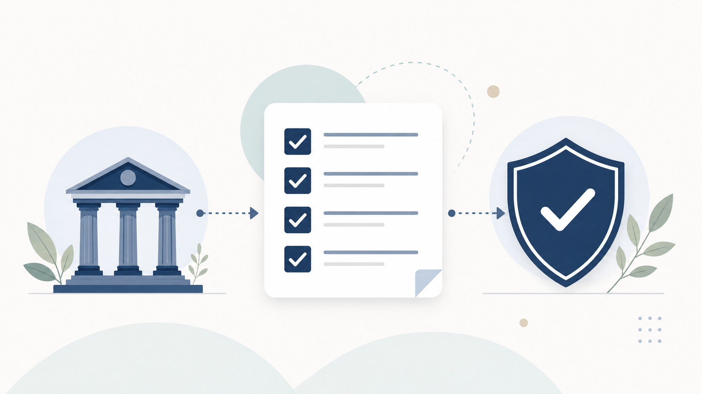

Иностранный заказчик готов платить, деньги реально нужны — а банк вместо перевода присылает запрос «пояснить экономический смысл операции». Разбираемся, как самозанятому айтишнику получать оплату из-за рубежа в 2026 году и не попасть под блокировку счёта.

Это не индивидуальная консультация — только ориентир. Суммы, лимиты и работающие каналы платежей меняются быстро, поэтому для своей ситуации сверяйтесь с приложением «Мой налог» или с бухгалтером.

## Почему НПД остаётся рабочей схемой для IT-фрилансера в 2026 году

Налог на профессиональный доход — это не отдельный налоговый режим для айтишников, а общий упрощённый спецрежим по 422-ФЗ от 27.11.2018, и для разработки, дизайна и консультаций он подходит без оговорок. Ставка 4% — если платит физлицо, 6% — если платит юрлицо или ИП, в том числе иностранное. Применять НПД может как обычное физлицо, так и ИП, но без наёмных сотрудников. Регистрация — через приложение «Мой налог», без визита в налоговую.

Список видов деятельности, запрещённых на НПД, вашего профиля не касается: туда попадают перепродажа товаров, добыча полезных ископаемых, посредничество, подакцизные товары, аренда нежилой недвижимости, продажа недвижимости и транспорта. С 1 января 2025 года в этот список добавили операции с криптовалютой — если вы берёте оплату в крипте, на НПД такой доход не оформить. Актуальный полный перечень запрещённых видов лучше сверить на npd.nalog.ru/faq перед тем, как принимать решение — список время от времени уточняют.

## Лимит по НПД в 2026 году: 2,4 млн рублей и как его не прощёлкать

2,4 миллиона рублей в год — вот весь лимит, и в 2026 году он не изменился. Считается он не по актам и не по датам выполненных работ, а по факту поступления денег на счёт — кассовым методом. Значит, если проект длился полгода, а оплата пришла одним платежом в декабре, вся сумма ляжет в доход того месяца, когда деньги реально зашли. Расходы лимит не уменьшают: НПД считается с оборота, а не с прибыли.

Информация о том, что лимит останется неизменным вплоть до 2028 года, встречается во вторичных источниках — прямого подтверждения в тексте закона нет, поэтому воспринимайте это как ожидание, а не гарантию.

Превысили лимит — статус НПД слетает автоматически, со дня превышения, никаких заявлений подавать не нужно, но и выбора у вас уже нет. Дальше физлицо переходит на НДФЛ по ставке 13% или 15% с превышения. ИП может уйти на УСН, но только если заявление на упрощёнку подано заранее — иначе его ждёт общая система налогообложения, а это НДС и куда более тяжёлая отчётность. Срок подачи заявления на УСН при слёте с НПД обычно называют 20 календарных дней, но прямого подтверждения этой цифры нет — перед тем как ориентироваться на неё, уточните в своей налоговой или у бухгалтера.

## Легально ли самозанятому в 2026 году получать оплату от иностранного заказчика

Да, получать оплату от нерезидента на счёт в российском банке можно — 173-ФЗ «О валютном регулировании и валютном контроле» прямого запрета на это не содержит. Специальный валютный счёт открывать не обязательно: платёж в валюте банк примет и на обычный счёт, а дальше сконвертирует по собственному курсу и правилам.

Уведомлять ФНС нужно только в одном случае — если вы открыли счёт за рубежом, не в российском банке. На это даётся месяц с момента открытия, по п. 2 ст. 12 закона 173-ФЗ. К такому счёту добавляется ежегодная обязанность: отчёт о движении средств (ОДДС) нужно сдать до 1 июня года, следующего за отчётным. Если же деньги приходят сразу на счёт в российском банке — никаких отдельных уведомлений ФНС не требуется.

За неуведомление об открытии зарубежного счёта называют штраф в 4–5 тысяч рублей для физлиц, но точная сумма и статья КоАП однозначного подтверждения не получили — не путайте это с гораздо более серьёзными штрафами по ст. 15.25 КоАП за незаконные валютные операции, там суммы совсем другого порядка.

## Каналы приёма оплаты от иностранных заказчиков в условиях санкций

Универсального рабочего канала на 2026 год нет — рабочей может оказаться комбинация из нескольких.

SWIFT-перевод напрямую из ЕС или США — самый очевидный вариант, но нестабильный: встречается оценка, что доходит от силы 15–30% таких платежей, однако цифра нигде официально не подтверждена, поэтому относитесь к ней как к ориентиру, а не к статистике. Более предсказуемо работает SWIFT через банки третьих стран — Армении, Казахстана, Киргизии, Беларуси, Китая: заказчик платит туда, а дальше деньги можно довести до карты «Мир» или счёта в российском банке.

UnionPay может выручить, но список банков-эмитентов, чьи карты реально принимают за рубежом, короткий и быстро меняется — на момент написания упоминались Россельхозбанк и Азиатско-Тихоокеанский банк. В Евросоюзе UnionPay российских банков перестал работать. Проверяйте актуальность списка непосредственно перед поездкой или настройкой платежей — вчерашняя рекомендация может уже не работать.

Для личных счетов по паспорту РФ с адресом в России Wise и Payoneer недоступны с 2022 года: Wise требует загранпаспорт и адрес проживания за пределами страны. У Payoneer чуть гибче с бизнес-аккаунтами — туда можно зайти с российским паспортом без вида на жительство, но это не касается личных счетов физлиц. Условия сервисов меняются без предупреждения — перед тем как на них рассчитывать, проверьте актуальные требования напрямую на сайтах Wise и Payoneer.

С фриланс-маркетплейсами тоже не всё просто: Upwork официально прекратил обслуживание пользователей из России и Беларуси. Ситуация может измениться — обязательно проверьте актуальный статус на момент, когда читаете этот текст, а не полагайтесь на факт двухлетней давности.

Криптовалюту как способ оплаты использовать нельзя — это прямой запрет п. 5 ст. 14 закона № 259-ФЗ от 31.07.2020, и он касается всех, включая самозанятых, независимо от того, где находится заказчик. С 2025 года доходы от операций с криптовалютой вообще нельзя учитывать в рамках НПД. Информация о штрафах в 100–200 тысяч рублей с 1 июля 2027 года и о возможной легализации крипты для внешнеторговых расчётов встречается в обсуждениях, но статус этих норм для обычного самозанятого физлица неясен — не стройте на них планы, пока не появится ясность.

## Почему банки блокируют счета самозанятых с иностранными переводами

Банк блокирует не из вредности, а потому что обязан — по 115-ФЗ, антиотмывочному закону, у него нет права пропустить операцию, которая выглядит подозрительно, без объяснений. Механика простая: банк, отказавший в операции, сообщает об этом в Центробанк, ЦБ формирует общий список отказников и рассылает его всем банкам — по Положению № 764-П от 15.07.2021. Обратите внимание: если вы встретите упоминание Положения № 639-П — оно устарело и отменено ещё с 1 сентября 2021 года, ориентируйтесь только на 764-П.

Что чаще всего вызывает вопросы у банка: нетипично много платежей за день — например, 20–30 вместо привычных пяти; операции без очевидного экономического смысла; транзитный характер переводов, когда деньги приходят и сразу уходят; крупные суммы (обязательный контроль начинается от 1 млн рублей, но точный порог зависит от вида операции, это стоит уточнить отдельно); вывод средств без подтверждающих документов; несоответствие операций заявленному виду деятельности в «Моём налоге».

Если банк прислал запрос с просьбой пояснить, что за платёж и откуда, — отвечайте. Игнорирование такого запроса — самый быстрый путь к блокировке.

## Чек-лист: как принимать оплату из-за рубежа и не попасть под блокировку

Указывайте в приложении «Мой налог» реальный вид деятельности — тот же, за что вам платит заказчик.

Держите под рукой договор или переписку с заказчиком, из которой видно, за что именно пришли деньги — это первое, что спросит банк.

Не дробите один платёж на много мелких и не создавайте искусственно частый поток переводов — именно это чаще всего выглядит как транзит.

Отвечайте на запросы банка быстро и по существу, с документами, а не отговорками.

Не смешивайте личные переводы (от друзей, родственников) с приёмом оплаты за работу на одном и том же счёте — так проще объяснить банку экономический смысл операций.

Периодически сверяйтесь с официальными «Методическими рекомендациями» Банка России по антиотмывочной теме на cbr.ru — но конкретные пункты оттуда стоит перепроверять напрямую, а не полагаться на пересказ.

## Что делать, если счёт уже заблокировали

Первый шаг — не в Центробанк, а в свой банк: попросите пересмотреть решение и предоставьте документы, которые банк запрашивал или которые объясняют операцию. Только после того, как банк откажет повторно, можно обращаться в Межведомственную комиссию при Банке России.

Обращение подаётся через «Интернет-приёмную» на сайте Банка России, в теме нужно указать «Обращение в Межведомственную комиссию... Закон № 115-ФЗ». Срок рассмотрения обычно называют в 20 рабочих дней, но регламент может пересматриваться — уточните его актуальную версию перед подачей, а не полагайтесь на цифру из этой статьи.

Есть риск, о котором стоит знать заранее: если банк отказывает вам или расторгает договор повторно — минимум дважды за год, — вы можете попасть в тот самый список отказников по 764-П, и тогда блокировки станут более вероятными уже в других банках.

## Самозанятость или ИП: когда IT-фрилансеру с иностранными заказчиками пора менять статус

Формальный документооборот по валютным операциям у ИП тяжелее, чем у самозанятого физлица с тем же оборотом, — и это стоит учитывать до, а не после регистрации ИП.

«Паспорт сделки» отменили ещё 1 марта 2018 года — вместо него банк ставит контракт на учёт и присваивает уникальный номер контракта (УНК), сообщая его вам не позднее следующего рабочего дня. Но пороги, при которых это включается, — от 3 млн рублей для импорта и кредитов, от 10 млн рублей для экспорта, — касаются ИП и юрлиц, а не физлиц на НПД. Самозанятого эта процедура не затрагивает вообще.

С 1 апреля 2024 года действует упрощённый валютный контроль для расчётов с нерезидентом через счёт в российском банке — для сумм примерно до 1 млн рублей, хотя этот порог пересматривался несколько раз и его стоит перепроверить на актуальную дату. Большинство разовых проектных платежей IT-фрилансера в эту упрощённую категорию как раз и попадает.

Вывод простой: пока вы физлицо на НПД и работаете без крупных контрактов, валютного документооборота у вас минимум. Переход на ИП имеет смысл, когда лимит НПД становится тесным, а не из-за валютного контроля как такового — по этой части ИП скорее добавит бумажной работы, чем снимет её.
